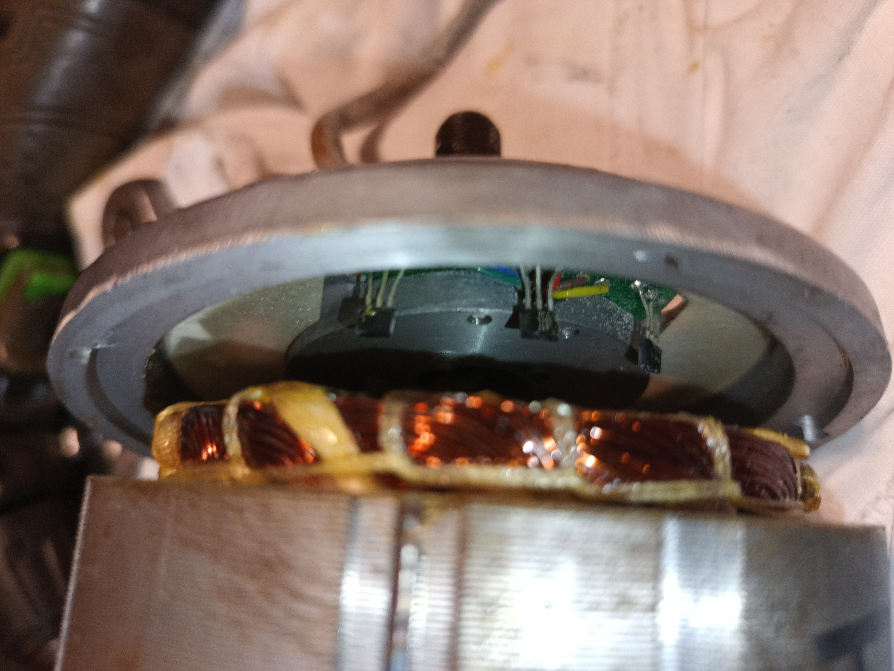

# Gazelle Orange Innergy 9-pin BLDC driver change

  

This tutorial has been created using text generated by a Large Language Model (LLM)

# Parts used in this tutorial

  

Thumb throttle lever with ignition switch and 10-100V voltmeter - https://nexun.pl/en/products/thumb-throttle-lever-with-ignition-switch-and-10-100v-voltmeter-570.html

  

Gt350 36-48V 18A controller Bldc - 
https://nexun.pl/en/products/gt350-36-48v-18a-controller-bldc-918.html?srsltid=AfmBOop4SNGHHrynI5W2j91td893-RAaFymPeyJa1B4oONB5fvMNkUQp

# Which driver to choose?

Choose a universal BLDC driver that supports both Hall and sensorless motors, rated for 250W–350W. Higher power is not recommended due to motor limitations.

# BLDC Motor Pinout

  

Hall 4 (H4) is unnecessary for universal BLDC driver. You can also use universal BLDC driver without Hall sensors.

  

Picture of Hall sensors.

# Original driver

  

Please cut wires (desoldering is not recommended). 

# Battery

  

# GT350 BLDC driver connection

Connect the GT350 driver as follows:

Power:

- Red (thick) = +BAT

- Black = GND

- Red (thin) = Ignition switch (connect to +BAT via switch)

Motor Phases:

- Blue, Yellow, Green = Motor phase wires

Hall Sensors:

- Red = +5V

- Black = GND

- Blue, Yellow, Green = Signal wires

Throttle (Black Plug):

- Red = +5V

- Black = GND

- Green = Signal

- Brakes:

- Yellow = Brake High (12V signal)

- White + Black = Brake Low (connect to GND to activate)

Other Functions:

- White + White = Self-learning mode

- Orange + Black (White Plug) = Cruise control

- Brown + Black (White Plug) = Reverse

- Orange-Black / Open / Black-Blue = Speed 3 / 2 / 1

- Yellow-Green = Speedometer signal (5V pulse)

Important: For reliability, cut all factory plugs. do not solder connections. Use connectors instead.

